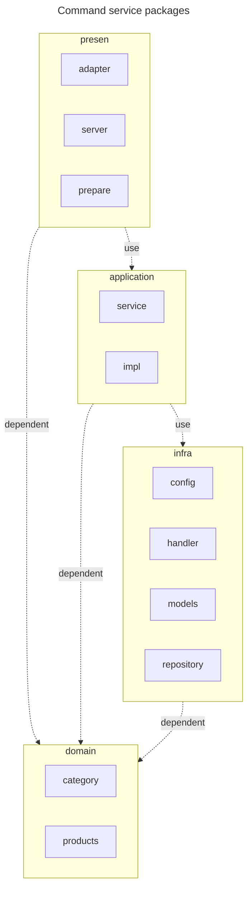

```mermaid
---
title: Command service packages
---
flowchart TB
    subgraph presen
        A-1[adapter]
        A-2[server]
        A-3[prepare]
    end
    subgraph application
        B-1[service]
        B-2[impl]
    end
    subgraph domain
        C-1[category]
        C-2[products]
    end
    subgraph infra
        D-1[config]
        D-2[handler]
        D-3[models]
        D-4[repository]
    end
    presen -.dependent.-> domain
    presen -.use.-> application
    application -.dependent.-> domain
    application -.use.-> infra
    infra -.dependent.-> domain
```